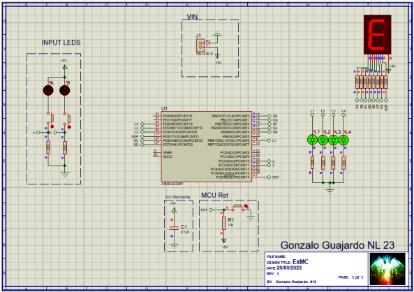

# Microcontroller-Based Electronic System with LEDs and 7-Segment Display Control

## Overview
This project involves the development of an electronic system using an Atmega328P microcontroller to manage the operation of four LEDs and a 7-segment display. The system is programmed to execute specific sequences triggered by switches:

- Sequence a) "00" - All LEDs are fully illuminated, and the 7-segment display shows an "E".
- Sequence b) "01" - LEDs display a descending 4-bit counter, while the display shows a "1".
- Sequence c) "10" - LEDs display an ascending 4-bit counter, while the display shows a "2".
- Sequence d) "11" - All LEDs turn off, and the display shows a descending counter from 9 to 0.

## Components
- Atmega328P Microcontroller
- LEDs (4)
- 7-Segment Display
- Switches (2)

## Code Description
- **Libraries**: AVR Standard I/O and delay library for managing time delays.
- **Constants and Macros**: Definition of oscillator frequency and bit manipulation macros.
- **Input Definitions**: Definitions for switch inputs and conditions for each sequence.
- **Output Definitions**: Definitions for controlling the 7-segment display segments and LEDs.
- **Functions**:
  - `init_port()`: Initializes ports for inputs and outputs.
  - `show_num(uint8_t output)`: Displays a specific number or character on the 7-segment display.
  - `off()`: Turns off all LEDs.
  - `on()`: Turns on all LEDs.
  - `ascend(uint8_t asc)`: Controls the ascending counter sequence.
  - `descend(uint8_t des)`: Controls the descending counter sequence.

## Usage
Users can interact with the system using two switches:
- Switch 1: Controls the first digit of the sequence.
- Switch 2: Controls the second digit of the sequence.

## Hardware Setup
Ensure proper connections between the microcontroller, LEDs, 7-segment display, and switches based on the defined port configurations in the code.

## Compilation and Execution
- Compile the code using an AVR C compiler.
- Upload the compiled binary to the microcontroller using a suitable programmer.

Above is a screenshot of the simulation in action, showing the display of different numbers on the 7-segment display.

